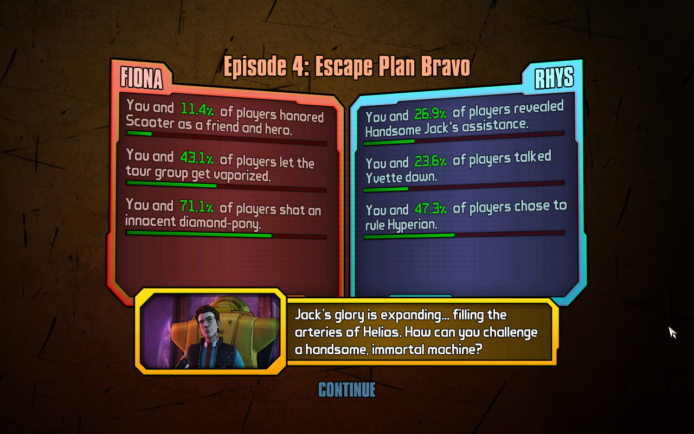

# React Tinder Card Example

A prototype telling an interactive story with a 'Tinder card' interface.

This protoype uses [react-tinder-card](https://github.com/3DJakob/react-tinder-card).

## Prototype demo

Try the demo [here!](https://mstfst.github.io/react-tinder-card-example/)

## Customize card content

In this prototype, card data is retrieved from <strong>./cardData.json</strong>

Each key/value pair in the object of cards represents a card ID and its corresponding data.

The starting card should always have ID `start`.

The prperties of each card's data are as follows:

* `text` -- the text of the card
* `leftText` -- text of the left button when the card is displyed
* `leftCardID` -- ID of the next card the user is shown when the left button is clicked
* `rightText` -- text of the right button when the card is displyed
* `rightCardID` -- ID of the next card the user is shown when the right button is clicked

## Possible protype enahncements
This prototype can be modified and enhanced in a number of ways, which may include the following:
  * Show stats/facts after a user's experience -- like how it is done in video games made by [Telltale](https://telltale.com/)
  
  * Apply [Google Analytics](https://analytics.google.com/) data tracking on buttons to collect data on how users play the story, gaining insights on user behavior and attitudes
  * Get card content from an external source such as [https://www.contentful.com/](Contentful)

## Contact me
Please feel free to contact me if you have any issues, comments, or questions.

Thanks for trying the [prototype](https://mstfst.github.io/react-tinder-card-example/).